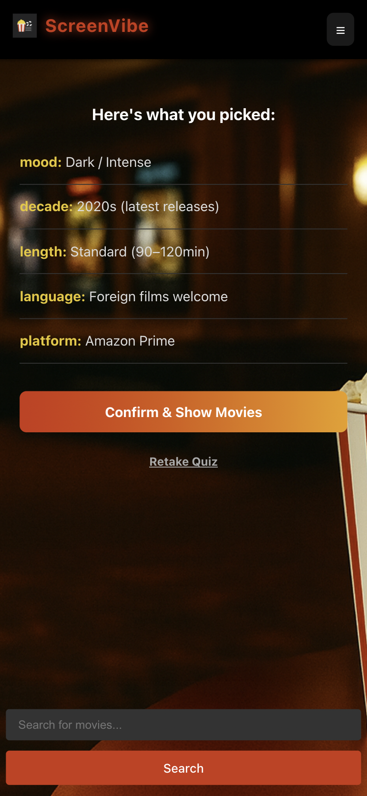
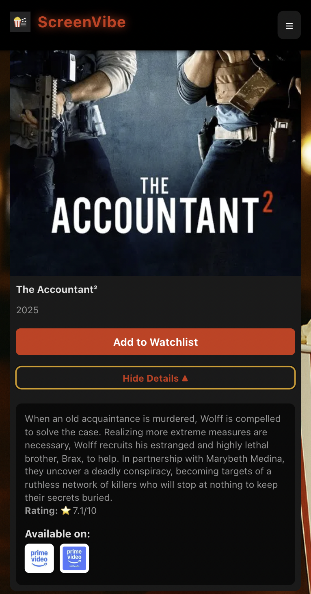
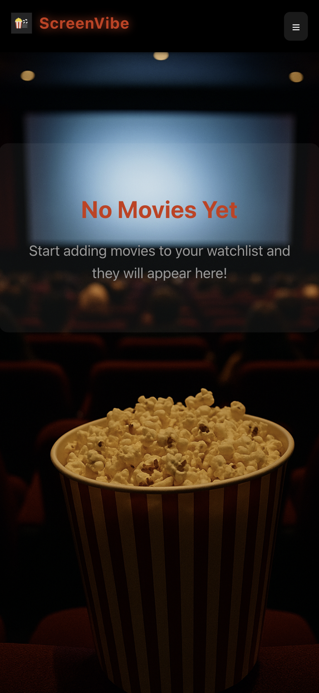

# 🍿 ScreenVibe

Find the perfect movie to match your mood. 
**ScreenVibe** is a React app that helps you pick what to watch by combining a movie quiz, search, and streaming availability.

---

## ✨ Features

- 🎭 **Mood-based quiz** – answer a few fun questions (mood, decade, runtime, language, platform) to get personalized movie picks.  
- 🔍 **Search** – quickly find any movie by title.  
- 🎬 **Movie cards** – clean layout with posters, descriptions, and details.  
- 📡 **Streaming info** – shows where movies are available to watch (e.g. Netflix, Prime, etc).  
- 📱 **Responsive design** – works smoothly on desktop and mobile, including small screens (iPhone SE tested).  
- 🍿 **Theatre-style UI** – popcorn, dark ambience, and cinematic vibes.  

---

## 📸 Screenshots

<p align="center">
  
  
</p>

<p align="center">
  
  
</p>

---

## 🛠 Tech Stack

- **Frontend:** React 
- **Styling:** CSS
- **Routing:** React Router  
- **API:** TMDB API (movies + providers)  
- **Version Control:** Git & GitHub  

---

## 🔗 Live Demo
👉 [ScreenVibe on Netlify](https://screen-vibe.netlify.app)

---

## 🚀 Getting Started

Follow these steps to run the project locally:

1. **Clone the repo**
```bash
git clone https://github.com/harrygooner1886/ScreenVibe.git
cd ScreenVibe
```

2. **Install dependencies**
```bash
npm install
```

3. **Add your TMDB API key**
- Create a `.env` file in the project root.  
- Add this line (replace with your own API key):  
```bash
REACT_APP_TMDB_API_KEY=your_api_key_here
```

4. **Run the app locally**
```bash
npm start
```

---

## 👤 Author  
https://github.com/harrygooner1886
